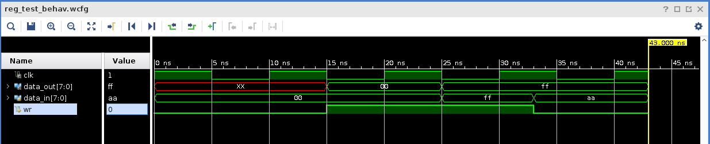
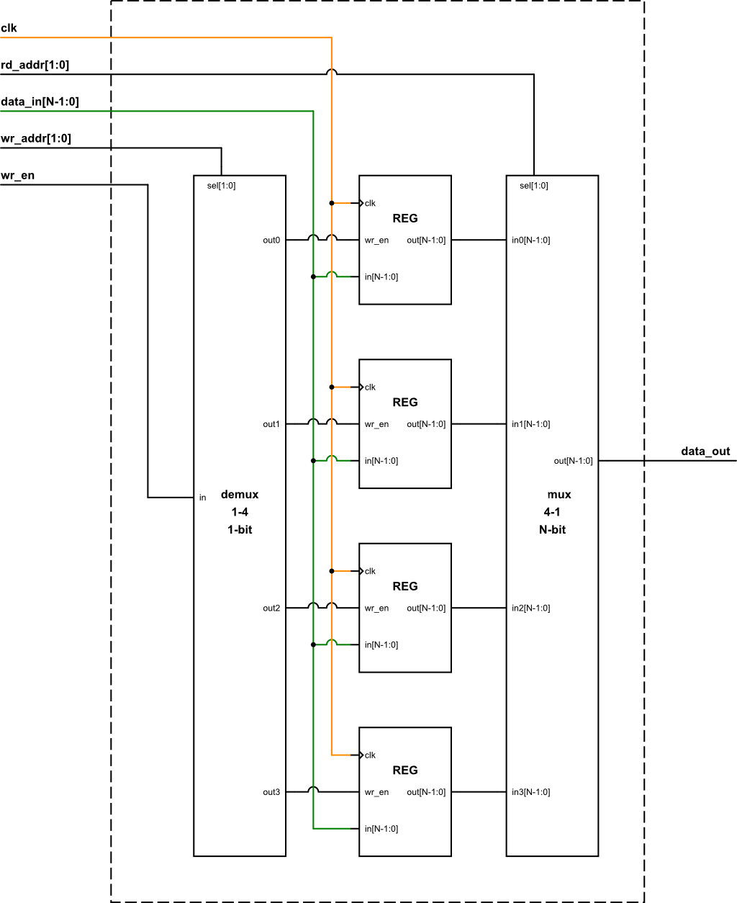

# Assignment for Lab 07 Registers

## Introduction

This goal of this assignment is to help you get more familier with registers and how to use them.

Please read the [coding standard](coding_standard.md).

## Problems
- Name the project as "Lab07".
- For all the simulations, you should use a oscillator with 10ns period (5ns hi, 5ns lo).
- Block diagrams can be embedded in this doc.

### 1. The following code constructs a ```REG``` module using a N-bit 2-way mux and N D-flipflops.
```verilog
module REG #(parameter SIZE=8)
   (input clk, wr_en,
    input [SIZE-1:0]  in,
    output [SIZE-1:0] out);

   wire [SIZE-1:0]    reg_in;
   mux2 #(.N(SIZE)) m(.in0(out), .in1(in), .sel(wr_en),
                      .out(reg_in));
   d_flip_flop d_ff[SIZE-1:0](.clk(clk), .d(reg_in), .q(out));

endmodule

```
- Describe the functionality of this module. (1pt)

- Draw a block diagram of this module in terms of mux and D-flipflop. (1pt)

- The following code is the test bench of ```REG``` module.
```verilog
module reg_test;
   localparam
     N = 8;

   wire clk;
   wire [N-1:0] data_out;
   reg [N-1:0]  data_in;
   reg          wr;

   oscillator clock(clk);

   REG  reg_unit(.clk(clk), .wr_en(wr), .in(data_in), .out(data_out));

   initial
     begin
        data_in = 0;
        #15;
        wr = 1;
        #10;
        data_in = 8'hFF;
        #10;
        wr = 0;
        data_in = 8'hAA;
        #10;
        $finish;
     end

endmodule // reg_test
```
  The timing diagram looks like this:
  
  

- Explain:
  - Why ```data_out``` changes from ```xx``` to ```00``` at 15ns? (1pt)
  - Why ```data_out``` changes from ```00``` to ```FF``` at 25ns? (1pt)
  - Why ```data_out``` maintains ```FF``` value at 35ns? (1pt)

### 3. Implement and test a N-bit 1-4 demux. (1 pts)
- Name this simulation set as "demux4\_test"
  ```verilog
  module demux4 #(parameter N=4) 
     (input  [N-1:0] in,
      input  [1:0]   sel,
      output [N-1:0] out0, out1, out2, out3);
  
  endmodule
  ```
- **Hint**: You can implement it using ```case``` statement.

### 4. The following block diagram describes an implementation of register file:

- Explain the functionality of the following ports
  - ```rd_addr``` and ```data_out``` (1pt)
  - ```wr_addr```, ```wr_en``` and ```data_in``` (1pt)
- Implenent the register file according to the block diagram and test its functions (2pts).
  - Name this simulation set as "regfile\_test"

