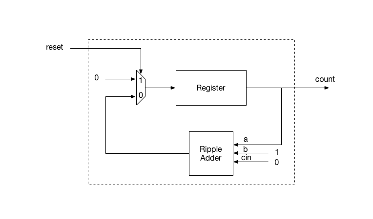

# Digital Logic Lab 07 - Registers

## References:
- [FPGA Prototyping By Verilog Examples: Xilinx Spartan-3 Version](https://www.amazon.com/FPGA-Prototyping-Verilog-Examples-Spartan-3/dp/0470185325/)
- [Quick Reference Guide](http://sutherland-hdl.com/pdfs/verilog_2001_ref_guide.pdf)

## Using Vivado:
- How to ask question
- Some of the problems from lab05 assignment.
  - Remove missing file:
    ```
    remove_files [get_files -filter {IS_AVAILABLE == 0}]
    ```
  - Missing files in simulation
    - How to use the scripts to fix your project file (xpr file).
- R6025 Runtime Error:
  - [Fix](https://www.xilinx.com/support/answers/69908.html)

## What we have learned so far
- [Basic Syntax](http://sutherland-hdl.com/pdfs/verilog_2001_ref_guide.pdf#page=8)
- [Data Type Declarations](http://sutherland-hdl.com/pdfs/verilog_2001_ref_guide.pdf#page=15)
- [Operators](http://sutherland-hdl.com/pdfs/verilog_2001_ref_guide.pdf#page=33)
  - ```w = {m, n}``` is concatenating ```m``` and ```n``` into ```w```
  - ```{m, n} = w``` is splitting ```w``` into ```m``` and ```n```
  - ```{N{m}}``` is duplicating ```m``` ```N``` times. ```N``` must be a constant.
- [Module Definition](http://sutherland-hdl.com/pdfs/verilog_2001_ref_guide.pdf#page=12)
- [Module Instances](http://sutherland-hdl.com/pdfs/verilog_2001_ref_guide.pdf#page=21)
- [Primitive Instances](http://sutherland-hdl.com/pdfs/verilog_2001_ref_guide.pdf#page=23)
- [Vector Bit Select and Part Selects](http://sutherland-hdl.com/pdfs/verilog_2001_ref_guide.pdf#page=20)
- [Blocking vs non-blocking assignment (page 29)](http://sutherland-hdl.com/pdfs/verilog_2001_ref_guide.pdf#page=29)
- [Procedural Blocks](http://sutherland-hdl.com/pdfs/verilog_2001_ref_guide.pdf#page=27)
  - ['always' Block (page 27)](http://sutherland-hdl.com/pdfs/verilog_2001_ref_guide.pdf#page=27)
- [Generate Block](http://sutherland-hdl.com/pdfs/verilog_2001_ref_guide.pdf#page=25)
- [Array of Instances](http://sutherland-hdl.com/pdfs/verilog_2001_ref_guide.pdf#page=22)
- [Parameter (page 19)](http://sutherland-hdl.com/pdfs/verilog_2001_ref_guide.pdf#page=19)
  - parameter vs localparam
    - [Parameter declaration](http://sutherland-hdl.com/pdfs/verilog_2001_ref_guide.pdf#page=19) and [paramter redefinition (page 21)](http://sutherland-hdl.com/pdfs/verilog_2001_ref_guide.pdf#page=21)
    - localparam: local constant

## Topics for this lab

- Implement and test a nand gate SR latch
  
  
  <!--  -->

<!-- - Implement and test a controlled SR -->

<!--    -->

- Implement and test a D-latch using nand gate SR latch

  
  <!--  -->

- Implement and test a D-type master-slave Flip-flops using two D-latches

  
  <!--  -->

- Implement and test a clock generator

  

  ```verilog
  module oscillator #(parameter HI=5, LO=5)
     (output reg clk);

  always
    begin
      clk <= 1'b1; #(HI);
      clk <= 1'b0; #(LO);
    end

  endmodule
  ```

- Implement and test a N-bit register

- Example: Implement and test a counter with a register

  
