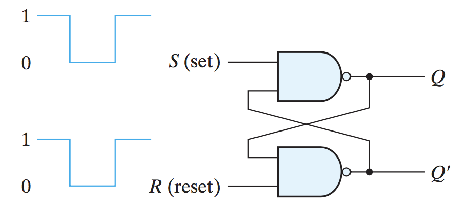
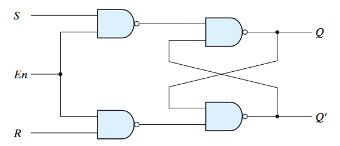
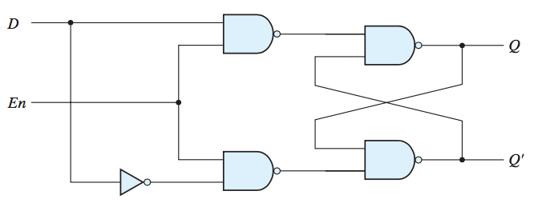
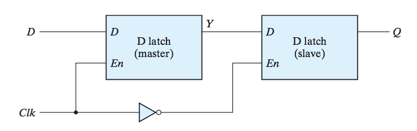
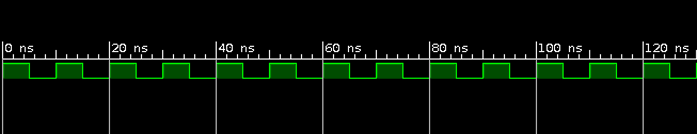
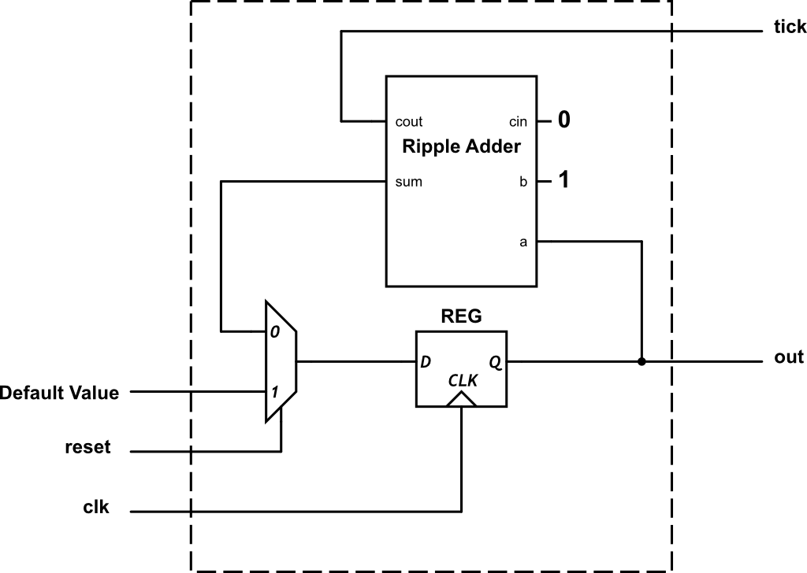

# Digital Logic Lab 07 - Registers

## References:
- [FPGA Prototyping By Verilog Examples: Xilinx Spartan-3 Version](https://www.amazon.com/FPGA-Prototyping-Verilog-Examples-Spartan-3/dp/0470185325/)
- [Quick Reference Guide](http://sutherland-hdl.com/pdfs/verilog_2001_ref_guide.pdf)

## What we covered last time
- [Operators](http://sutherland-hdl.com/pdfs/verilog_2001_ref_guide.pdf#page=33)
  - ```w = {m, n}``` is concatenating ```m``` and ```n``` into ```w```
  - ```{m, n} = w``` is splitting ```w``` into ```m``` and ```n```
  - ```{N{m}}``` is duplicating ```m``` ```N``` times. ```N``` must be a constant.
- [Module Definition](http://sutherland-hdl.com/pdfs/verilog_2001_ref_guide.pdf#page=12)
- [Module Instances](http://sutherland-hdl.com/pdfs/verilog_2001_ref_guide.pdf#page=21)
- [Primitive Instances](http://sutherland-hdl.com/pdfs/verilog_2001_ref_guide.pdf#page=23)
- [Vector Bit Select and Part Selects](http://sutherland-hdl.com/pdfs/verilog_2001_ref_guide.pdf#page=20)
- [Blocking vs non-blocking assignment](http://sutherland-hdl.com/pdfs/verilog_2001_ref_guide.pdf#page=29)
- [Generate Block](http://sutherland-hdl.com/pdfs/verilog_2001_ref_guide.pdf#page=25)
- [Array of Instances](http://sutherland-hdl.com/pdfs/verilog_2001_ref_guide.pdf#page=22)
- [Parameter](http://sutherland-hdl.com/pdfs/verilog_2001_ref_guide.pdf#page=19)

## Topics for this lab

- Implement and test a nand gate SR latch
  
  

- Implement and test a controlled SR

  

- Implement and test a D-latch using nand gate SR latch

  

- Implement and test a D-type master-slave Flip-flops using two D-latches

  

- Implement and test a clock generator

  

- Implement and test a simple counter

  
